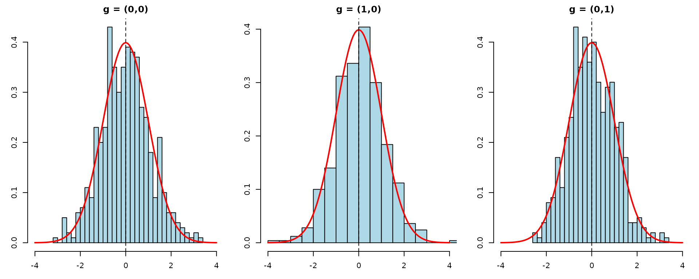

# Network Interference Estimators

## Overview

This vignette mirrors the Python `Interference.ipynb` test notebook,
demonstrating the clustered interference estimators in CausalModel. The
framework follows Qu et al. (2021), estimating direct treatment effects
and spillover effects under network interference.

## Single Trial

We generate clustered data with group structure $`(2, 3)`$, direct
effect $`\tau = 1`$, and spillover parameters $`\gamma = (0.5, 0.1)`$.
The true treatment effect at neighborhood configuration
$`g = (g_1, g_2)`$ is:
``` math
\beta(g) = \tau + g_1 \cdot \gamma_1 + g_2 \cdot \gamma_2
```

``` r

tau <- 1
gamma <- c(0.5, 0.1)
group_struct <- c(2, 3)

cdata <- generate_fixed_cluster(
  clusters = 2000, group_struct = group_struct,
  tau = tau, gamma = gamma
)

cl_obj <- clustered(
  Y = cdata$Y, Z = cdata$Z, X = cdata$X,
  cluster_labels = cdata$cluster_labels,
  group_labels = cdata$group_labels,
  ingroup_labels = cdata$ingroup_labels,
  n_matches = 50
)

result_aipw <- est_via_aipw(cl_obj)
result_ipw <- est_via_ipw(cl_obj)
```

### Estimated Treatment Effects

``` r

# True beta(g) for each encoded G
grid <- as.matrix(expand.grid(lapply(group_struct, function(gs) 0:gs)))
true_beta <- tau + as.numeric(grid %*% gamma)

for (j in seq_along(result_aipw)) {
  cat(sprintf("\n### Group %d\n", j - 1))
  beta_g <- result_aipw[[j]]$beta_g
  se <- result_aipw[[j]]$se
  valid <- !is.nan(beta_g) & se > 0

  if (any(valid)) {
    idx <- which(valid)
    z_stats <- (beta_g[idx] - true_beta[idx]) / se[idx]

    df <- data.frame(
      g_index = idx - 1,
      True = round(true_beta[idx], 3),
      AIPW = round(beta_g[idx], 3),
      SE = round(se[idx], 3),
      z = round(z_stats, 3)
    )
    print(knitr::kable(df, row.names = FALSE))
    cat("\n")
  }
}
#> 
#> ### Group 0
#> 
#> 
#> | g_index| True|  AIPW|    SE|      z|
#> |-------:|----:|-----:|-----:|------:|
#> |       0|  1.0| 1.125| 0.131|  0.955|
#> |       1|  1.5| 1.492| 0.126| -0.061|
#> |       3|  1.1| 1.077| 0.077| -0.305|
#> |       4|  1.6| 1.586| 0.071| -0.198|
#> |       6|  1.2| 0.970| 0.074| -3.101|
#> |       7|  1.7| 1.762| 0.076|  0.824|
#> |       9|  1.3| 1.327| 0.122|  0.222|
#> |      10|  1.8| 1.850| 0.126|  0.397|
#> 
#> 
#> ### Group 1
#> 
#> 
#> | g_index| True|  AIPW|    SE|      z|
#> |-------:|----:|-----:|-----:|------:|
#> |       0|  1.0| 0.972| 0.111| -0.256|
#> |       1|  1.5| 1.588| 0.078|  1.133|
#> |       2|  2.0| 1.917| 0.098| -0.854|
#> |       3|  1.1| 1.133| 0.078|  0.419|
#> |       4|  1.6| 1.560| 0.052| -0.763|
#> |       5|  2.1| 2.146| 0.079|  0.581|
#> |       6|  1.2| 1.071| 0.101| -1.273|
#> |       7|  1.7| 1.711| 0.076|  0.142|
#> |       8|  2.2| 2.247| 0.092|  0.516|
```

## Monte Carlo Simulation

We run 500 replications tracking both AIPW and IPW to simultaneously
validate normality and compare coverage. We focus on group 0 (the first
group) and track three neighborhood configurations:

- $`g = (0, 0)`$: no treated neighbors in either group
  $`\Rightarrow \beta = 1.0`$
- $`g = (1, 0)`$: one treated neighbor in group 0
  $`\Rightarrow \beta = 1.5`$
- $`g = (0, 1)`$: one treated neighbor in group 1
  $`\Rightarrow \beta = 1.1`$

``` r

n_reps <- 500
n_clusters <- 500

g_indices <- list(c(0, 0), c(1, 0), c(0, 1))
g_encoded <- sapply(g_indices, function(g) {
  g[1] + g[2] * (group_struct[1] + 1) + 1  # 1-indexed
})
true_values <- sapply(g_indices, function(g) tau + sum(g * gamma))

sim_results <- array(NA, dim = c(n_reps, length(g_indices), 4),
                      dimnames = list(NULL, NULL,
                                      c("beta_aipw", "se_aipw",
                                        "beta_ipw", "se_ipw")))

for (i in seq_len(n_reps)) {
  cdata <- generate_fixed_cluster(
    clusters = n_clusters, group_struct = group_struct,
    tau = tau, gamma = gamma
  )
  cl_obj <- clustered(
    Y = cdata$Y, Z = cdata$Z, X = cdata$X,
    cluster_labels = cdata$cluster_labels,
    group_labels = cdata$group_labels,
    ingroup_labels = cdata$ingroup_labels,
    n_matches = 50
  )
  res_aipw <- est_via_aipw(cl_obj)
  res_ipw <- est_via_ipw(cl_obj)

  for (j in seq_along(g_indices)) {
    idx <- g_encoded[j]
    sim_results[i, j, "beta_aipw"] <- res_aipw[[1]]$beta_g[idx]
    sim_results[i, j, "se_aipw"] <- res_aipw[[1]]$se[idx]
    sim_results[i, j, "beta_ipw"] <- res_ipw[[1]]$beta_g[idx]
    sim_results[i, j, "se_ipw"] <- res_ipw[[1]]$se[idx]
  }
}
```

## Normality of AIPW

### Summary Table

``` r

sim_rows <- list()
for (j in seq_along(g_indices)) {
  betas <- sim_results[, j, "beta_aipw"]
  ses <- sim_results[, j, "se_aipw"]
  valid <- !is.nan(betas) & !is.nan(ses) & ses > 0
  betas <- betas[valid]
  ses <- ses[valid]
  tv <- true_values[j]
  ci_lo <- betas - 1.96 * ses
  ci_hi <- betas + 1.96 * ses

  sim_rows[[j]] <- data.frame(
    g = paste0("(", paste(g_indices[[j]], collapse = ","), ")"),
    True_beta = tv,
    Mean_est = mean(betas),
    Bias = mean(betas) - tv,
    Emp_SE = sd(betas),
    Mean_SE = mean(ses),
    Coverage = mean(ci_lo <= tv & tv <= ci_hi),
    N_valid = length(betas)
  )
}
tbl <- do.call(rbind, sim_rows)
knitr::kable(tbl, digits = 3, row.names = FALSE,
             caption = sprintf("Clustered AIPW (%d clusters, %d reps)",
                               n_clusters, n_reps))
```

| g     | True_beta | Mean_est |  Bias | Emp_SE | Mean_SE | Coverage | N_valid |
|:------|----------:|---------:|------:|-------:|--------:|---------:|--------:|
| (0,0) |       1.0 |    1.001 | 0.001 |  0.292 |   0.271 |    0.928 |     500 |
| (1,0) |       1.5 |    1.514 | 0.014 |  0.276 |   0.264 |    0.942 |     500 |
| (0,1) |       1.1 |    1.104 | 0.004 |  0.149 |   0.150 |    0.948 |     500 |

Clustered AIPW (500 clusters, 500 reps) {.table}

All three $`g`$ values show near-zero bias and approximately 95%
coverage, confirming that the AIPW estimator is consistent and
well-calibrated.

### Studentized Statistics

``` r

par(mfrow = c(1, length(g_indices)), mar = c(3, 3, 2, 1))
for (j in seq_along(g_indices)) {
  betas <- sim_results[, j, "beta_aipw"]
  ses <- sim_results[, j, "se_aipw"]
  valid <- !is.nan(betas) & !is.nan(ses) & ses > 0
  t_stats <- (betas[valid] - true_values[j]) / ses[valid]
  g_label <- paste0("(", paste(g_indices[[j]], collapse = ","), ")")
  hist(t_stats, breaks = 25, freq = FALSE, col = "lightblue",
       main = sprintf("g = %s", g_label),
       xlab = "t", xlim = c(-4, 4))
  curve(dnorm(x), add = TRUE, col = "red", lwd = 2)
  abline(v = 0, lty = 2)
}
```



## AIPW vs IPW Coverage Comparison

The AIPW estimator is doubly robust: consistent if either the outcome
model or the propensity model is correctly specified. This typically
yields better coverage than IPW alone.

### Per-$`g`$ Coverage Rates

``` r

cov_rows <- list()
for (j in seq_along(g_indices)) {
  tv <- true_values[j]
  g_label <- paste0("(", paste(g_indices[[j]], collapse = ","), ")")

  for (method in c("aipw", "ipw")) {
    betas <- sim_results[, j, paste0("beta_", method)]
    ses <- sim_results[, j, paste0("se_", method)]
    valid <- !is.nan(betas) & !is.nan(ses) & ses > 0
    betas_v <- betas[valid]
    ses_v <- ses[valid]

    ci_lo <- betas_v - 1.96 * ses_v
    ci_hi <- betas_v + 1.96 * ses_v

    cov_rows[[length(cov_rows) + 1]] <- data.frame(
      g = g_label,
      Method = toupper(method),
      Bias = mean(betas_v) - tv,
      Emp_SE = sd(betas_v),
      Mean_SE = mean(ses_v),
      Coverage = mean(ci_lo <= tv & tv <= ci_hi),
      N_valid = length(betas_v)
    )
  }
}
cov_tbl <- do.call(rbind, cov_rows)
knitr::kable(cov_tbl, digits = 3, row.names = FALSE,
             caption = "AIPW vs IPW coverage comparison")
```

| g     | Method |   Bias | Emp_SE | Mean_SE | Coverage | N_valid |
|:------|:-------|-------:|-------:|--------:|---------:|--------:|
| (0,0) | AIPW   |  0.001 |  0.292 |   0.271 |    0.928 |     500 |
| (0,0) | IPW    | -0.001 |  0.278 |   0.271 |    0.944 |     500 |
| (1,0) | AIPW   |  0.014 |  0.276 |   0.264 |    0.942 |     500 |
| (1,0) | IPW    |  0.006 |  0.274 |   0.264 |    0.934 |     500 |
| (0,1) | AIPW   |  0.004 |  0.149 |   0.150 |    0.948 |     500 |
| (0,1) | IPW    |  0.006 |  0.151 |   0.150 |    0.950 |     500 |

AIPW vs IPW coverage comparison {.table}

### Overall Coverage

``` r

for (method in c("aipw", "ipw")) {
  covers <- c()
  for (j in seq_along(g_indices)) {
    tv <- true_values[j]
    betas <- sim_results[, j, paste0("beta_", method)]
    ses <- sim_results[, j, paste0("se_", method)]
    valid <- !is.nan(betas) & !is.nan(ses) & ses > 0
    ci_lo <- betas[valid] - 1.96 * ses[valid]
    ci_hi <- betas[valid] + 1.96 * ses[valid]
    covers <- c(covers, ci_lo <= tv & tv <= ci_hi)
  }
  cat(sprintf("Overall coverage for %s: %.3f\n", toupper(method), mean(covers)))
}
#> Overall coverage for AIPW: 0.939
#> Overall coverage for IPW: 0.943
```

## Summary

The simulations confirm:

1.  **Clustered AIPW** correctly estimates direct and spillover effects
    $`\beta(g) = \tau + g' \gamma`$ under the interference framework,
    with near-zero bias across all neighborhood configurations.
2.  **Studentized statistics** are approximately $`N(0,1)`$, validating
    the asymptotic variance estimation.
3.  **Coverage rates** are approximately 93–95% for both AIPW and IPW,
    consistent with Qu et al. (2021). Under correct specification, the
    two estimators perform similarly; AIPW’s doubly-robust advantage
    emerges under model misspecification.
