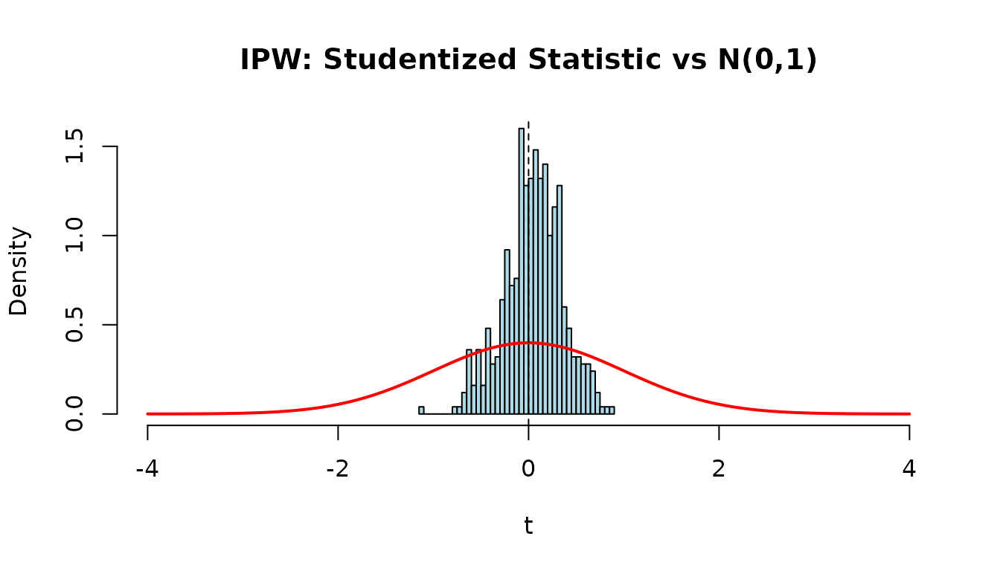
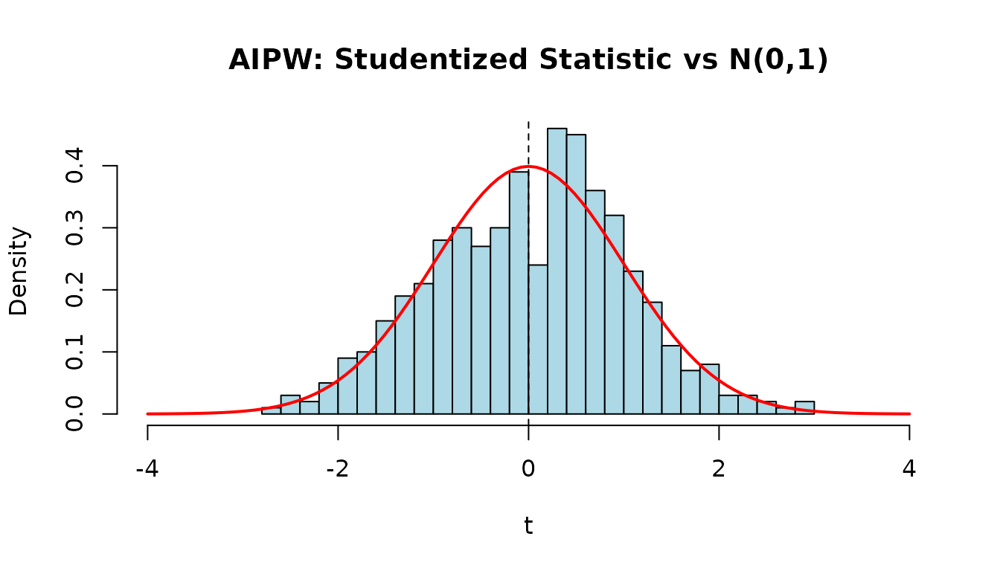
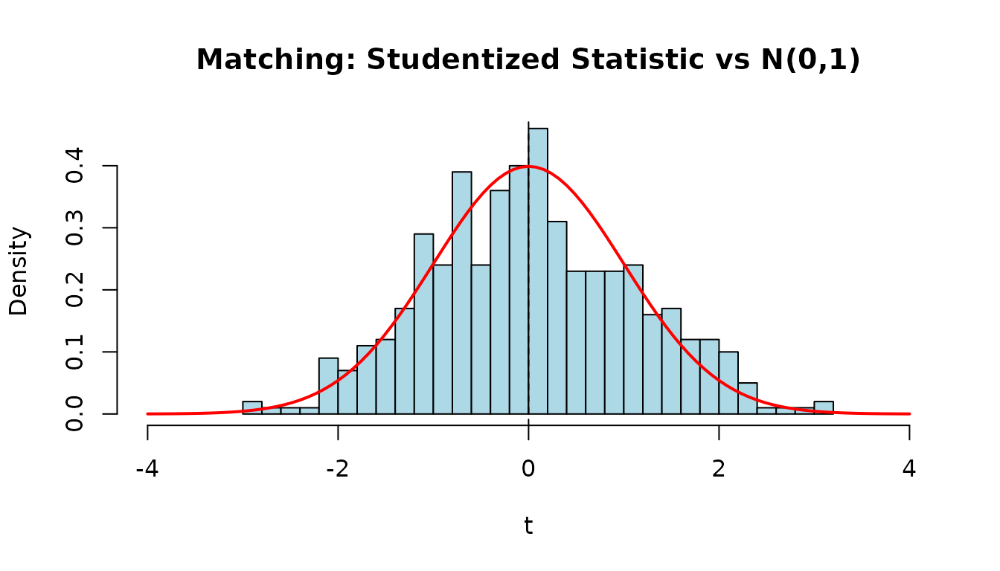
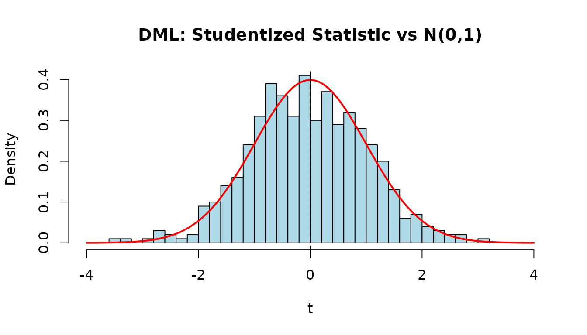
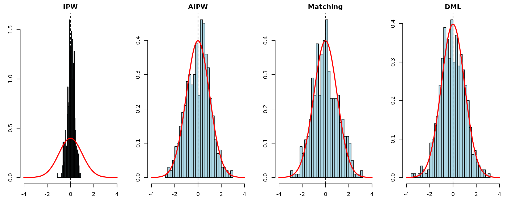

# Observational Study Estimators

## Overview

This vignette mirrors the Python `observational.ipynb` test notebook,
demonstrating all observational-study estimators in CausalModel and
validating their asymptotic properties via Monte Carlo simulation.

## Basic Usage

### Binary Treatment

Generate data with known $`\tau = 10`$ and apply each estimator:

``` r

data <- generate_data(N = 10000, k = 5, tau = 10)
obs <- observational(data$Y, data$Z, data$X)

est_via_ols(obs)
#> Causal Model Estimation Result
#> ------------------------------
#>   ATE:      9.994851
#>   SE:       0.015584
#>   z:        641.3514
#>   p-value:  0.0000
#>   95% CI:   [9.964307, 10.025396]
est_via_ipw(obs)
#> Causal Model Estimation Result
#> ------------------------------
#>   ATE:      10.074435
#>   SE:       0.143352
#>   z:        70.2778
#>   p-value:  0.0000
#>   95% CI:   [9.793471, 10.355399]
est_via_aipw(obs)
#> Causal Model Estimation Result
#> ------------------------------
#>   ATE:      9.993525
#>   SE:       0.025922
#>   z:        385.5206
#>   p-value:  0.0000
#>   95% CI:   [9.942719, 10.044332]
est_via_matching(obs, num_matches = 10, num_matches_for_var = 20)
#> Causal Model Estimation Result
#> ------------------------------
#>   ATE:      10.352785
#>   SE:       0.026788
#>   z:        386.4663
#>   p-value:  0.0000
#>   95% CI:   [10.300281, 10.405290]
est_via_matching(obs, num_matches = 10, num_matches_for_var = 20, bias_adj = TRUE)
#> Causal Model Estimation Result
#> ------------------------------
#>   ATE:      10.004235
#>   SE:       0.027014
#>   z:        370.3334
#>   p-value:  0.0000
#>   95% CI:   [9.951289, 10.057182]
```

### Continuous Treatment (DML)

``` r

data_c <- generate_data_continuous(N = 10000, k = 5, tau = 10)
obs_c <- observational(data_c$Y, data_c$Z, data_c$X)
est_via_dml(obs_c)
#> Causal Model Estimation Result
#> ------------------------------
#>   ATE:      9.988061
#>   SE:       0.009900
#>   z:        1008.9088
#>   p-value:  0.0000
#>   95% CI:   [9.968658, 10.007464]
```

## Simulation 1: IPW

We run 500 replications of IPW estimation to check that the studentized
statistic $`T = (\hat{\tau} - \tau) / \widehat{SE}`$ is approximately
$`N(0,1)`$.

``` r

n_reps <- 500
tau <- 10

ipw_results <- matrix(NA, nrow = n_reps, ncol = 2,
                       dimnames = list(NULL, c("ate", "se")))

for (i in seq_len(n_reps)) {
  data <- generate_data(N = 1000, k = 2, tau = tau)
  obs <- observational(data$Y, data$Z, data$X)
  r <- est_via_ipw(obs)
  ipw_results[i, ] <- c(r$ate, r$se)
}
```

``` r

t_ipw <- (ipw_results[, "ate"] - tau) / ipw_results[, "se"]
hist(t_ipw, breaks = 30, freq = FALSE, col = "lightblue",
     main = "IPW: Studentized Statistic vs N(0,1)",
     xlab = "t", xlim = c(-4, 4))
curve(dnorm(x), add = TRUE, col = "red", lwd = 2)
abline(v = 0, lty = 2)
```



``` r

ates <- ipw_results[, "ate"]
ses <- ipw_results[, "se"]
ci_lo <- ates - 1.96 * ses
ci_hi <- ates + 1.96 * ses
knitr::kable(data.frame(
  Bias = mean(ates) - tau,
  RMSE = sqrt(mean((ates - tau)^2)),
  Mean_SE = mean(ses),
  Emp_SE = sd(ates),
  Coverage = mean(ci_lo <= tau & tau <= ci_hi)
), digits = 3, caption = "IPW (N=1000, 500 reps)")
```

|  Bias | RMSE | Mean_SE | Emp_SE | Coverage |
|------:|-----:|--------:|-------:|---------:|
| 0.014 | 0.15 |   0.448 |  0.149 |        1 |

IPW (N=1000, 500 reps) {.table}

## Simulation 2: AIPW

``` r

aipw_results <- matrix(NA, nrow = n_reps, ncol = 2,
                        dimnames = list(NULL, c("ate", "se")))

for (i in seq_len(n_reps)) {
  data <- generate_data(N = 1000, k = 2, tau = tau)
  obs <- observational(data$Y, data$Z, data$X)
  r <- est_via_aipw(obs)
  aipw_results[i, ] <- c(r$ate, r$se)
}
```

``` r

t_aipw <- (aipw_results[, "ate"] - tau) / aipw_results[, "se"]
hist(t_aipw, breaks = 30, freq = FALSE, col = "lightblue",
     main = "AIPW: Studentized Statistic vs N(0,1)",
     xlab = "t", xlim = c(-4, 4))
curve(dnorm(x), add = TRUE, col = "red", lwd = 2)
abline(v = 0, lty = 2)
```



``` r

ates <- aipw_results[, "ate"]
ses <- aipw_results[, "se"]
ci_lo <- ates - 1.96 * ses
ci_hi <- ates + 1.96 * ses
knitr::kable(data.frame(
  Bias = mean(ates) - tau,
  RMSE = sqrt(mean((ates - tau)^2)),
  Mean_SE = mean(ses),
  Emp_SE = sd(ates),
  Coverage = mean(ci_lo <= tau & tau <= ci_hi)
), digits = 3, caption = "AIPW (N=1000, 500 reps)")
```

|  Bias |  RMSE | Mean_SE | Emp_SE | Coverage |
|------:|------:|--------:|-------:|---------:|
| 0.002 | 0.087 |   0.086 |  0.087 |    0.954 |

AIPW (N=1000, 500 reps) {.table}

## Simulation 3: Matching

Nearest-neighbor matching with bias adjustment.

``` r

match_results <- matrix(NA, nrow = n_reps, ncol = 2,
                         dimnames = list(NULL, c("ate", "se")))

for (i in seq_len(n_reps)) {
  data <- generate_data(N = 1000, k = 2, tau = tau)
  obs <- observational(data$Y, data$Z, data$X)
  r <- est_via_matching(obs, num_matches = 1, bias_adj = TRUE)
  match_results[i, ] <- c(r$ate, r$se)
}
```

``` r

t_match <- (match_results[, "ate"] - tau) / match_results[, "se"]
hist(t_match, breaks = 30, freq = FALSE, col = "lightblue",
     main = "Matching: Studentized Statistic vs N(0,1)",
     xlab = "t", xlim = c(-4, 4))
curve(dnorm(x), add = TRUE, col = "red", lwd = 2)
abline(v = 0, lty = 2)
```



``` r

ates <- match_results[, "ate"]
ses <- match_results[, "se"]
ci_lo <- ates - 1.96 * ses
ci_hi <- ates + 1.96 * ses
knitr::kable(data.frame(
  Bias = mean(ates) - tau,
  RMSE = sqrt(mean((ates - tau)^2)),
  Mean_SE = mean(ses),
  Emp_SE = sd(ates),
  Coverage = mean(ci_lo <= tau & tau <= ci_hi)
), digits = 3, caption = "Matching (N=1000, 500 reps)")
```

|  Bias | RMSE | Mean_SE | Emp_SE | Coverage |
|------:|-----:|--------:|-------:|---------:|
| 0.001 |  0.1 |   0.092 |    0.1 |    0.924 |

Matching (N=1000, 500 reps) {.table}

## Simulation 4: DML (Continuous Treatment)

Double machine learning with 2-fold cross-fitting for continuous
treatment.

``` r

dml_results <- matrix(NA, nrow = n_reps, ncol = 2,
                       dimnames = list(NULL, c("ate", "se")))

for (i in seq_len(n_reps)) {
  data <- generate_data_continuous(N = 1000, k = 2, tau = tau)
  obs <- observational(data$Y, data$Z, data$X)
  r <- est_via_dml(obs, k_folds = 2)
  dml_results[i, ] <- c(r$ate, r$se)
}
```

``` r

t_dml <- (dml_results[, "ate"] - tau) / dml_results[, "se"]
hist(t_dml, breaks = 30, freq = FALSE, col = "lightblue",
     main = "DML: Studentized Statistic vs N(0,1)",
     xlab = "t", xlim = c(-4, 4))
curve(dnorm(x), add = TRUE, col = "red", lwd = 2)
abline(v = 0, lty = 2)
```



``` r

ates <- dml_results[, "ate"]
ses <- dml_results[, "se"]
ci_lo <- ates - 1.96 * ses
ci_hi <- ates + 1.96 * ses
knitr::kable(data.frame(
  Bias = mean(ates) - tau,
  RMSE = sqrt(mean((ates - tau)^2)),
  Mean_SE = mean(ses),
  Emp_SE = sd(ates),
  Coverage = mean(ci_lo <= tau & tau <= ci_hi)
), digits = 3, caption = "DML (N=1000, 500 reps)")
```

|   Bias |  RMSE | Mean_SE | Emp_SE | Coverage |
|-------:|------:|--------:|-------:|---------:|
| -0.001 | 0.032 |   0.031 |  0.032 |    0.948 |

DML (N=1000, 500 reps) {.table}

## All Histograms

Summary panel of all four estimators:

``` r

par(mfrow = c(1, 4), mar = c(3, 3, 2, 1))
for (info in list(
  list(t_ipw, "IPW"), list(t_aipw, "AIPW"),
  list(t_match, "Matching"), list(t_dml, "DML"))) {
  hist(info[[1]], breaks = 30, freq = FALSE, col = "lightblue",
       main = info[[2]], xlab = "t", xlim = c(-4, 4))
  curve(dnorm(x), add = TRUE, col = "red", lwd = 2)
  abline(v = 0, lty = 2)
}
```



## Summary

All four estimators produce studentized statistics that are
approximately $`N(0,1)`$ under correct specification, confirming:

- Unbiasedness of the ATE estimates
- Consistency of the SE estimates
- Approximately 95% coverage of the confidence intervals
